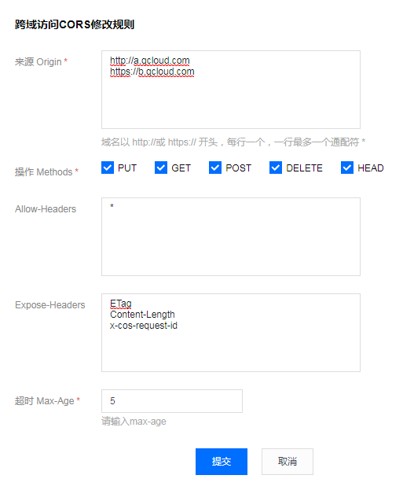

# cos-js-sdk-v5

腾讯云 COS JS SDK（[XML API](https://cloud.tencent.com/document/product/436/7751)）

[releases and changelog](https://github.com/tencentyun/cos-js-sdk-v5/releases)

## Get started

### 一、前期准备

1. 首先，JS SDK 需要浏览器支持基本的 HTML5 特性，以便支持 ajax 上传文件和计算文件 md5 值。
2. 到 [COS对象存储控制台](https://console.cloud.tencent.com/cos) 创建存储桶，得到 Bucket（存储桶名称） 和 [Region（地域名称）](https://cloud.tencent.com/document/product/436/6224)
3. 到 [控制台密钥管理](https://console.cloud.tencent.com/capi) 获取您的项目 SecretId 和 SecretKey
4. 配置 CORS 规则，配置例子如下图：



### 二、计算签名

由于签名计算放在前端会暴露 SecretId 和 SecretKey，我们把签名计算过程放在后端实现，前端通过 ajax 向后端获取签名结果，正式部署时请再后端加一层自己网站本身的权限检验。

这里提供 [PHP 和 NodeJS 的签名例子](https://github.com/tencentyun/cos-js-sdk-v5/blob/master/server/)，其他语言，请参照对应的 [XML SDK](https://cloud.tencent.com/document/product/436/6474)

### 三、上传例子

1. 创建 test.html，填入下面的代码，修改里面的 Bucket 和 Region。
2. 部署好后端的签名服务，并修改 getAuthorization 里的签名服务地址
3. 把 test.html 放在 Web 服务器下，然后在浏览器访问页面，测试文件上传

```html
<input id="file-selector" type="file">
<script src="dist/cos-js-sdk-v5.min.js"></script>
<script>
var Bucket = 'test-1250000000';
var Region = 'ap-guangzhou';

// 初始化实例
var cos = new COS({
    getAuthorization: function (options, callback) {
        var url = '../server/sts.php'; // 这里替换成您的服务接口地址
        var xhr = new XMLHttpRequest();
        xhr.open('GET', url, true);
        xhr.onload = function (e) {
            try {
                var data = JSON.parse(e.target.responseText);
                var credentials = data.credentials;
            } catch (e) {
            }
            if (!data || !credentials) return console.error('credentials invalid');
            callback({
                TmpSecretId: credentials.tmpSecretId,
                TmpSecretKey: credentials.tmpSecretKey,
                XCosSecurityToken: credentials.sessionToken,
                StartTime: data.startTime, // 时间戳，单位秒，如：1580000000，建议返回服务器时间作为签名的开始时间，避免用户浏览器本地时间偏差过大导致签名错误
                ExpiredTime: data.expiredTime, // 时间戳，单位秒，如：1580000900
            });
        };
        xhr.send();
    }
});

// 监听选文件
document.getElementById('file-selector').onchange = function () {

    var file = this.files[0];
    if (!file) return;

    // 分片上传文件
    cos.sliceUploadFile({
        Bucket: Bucket,
        Region: Region,
        Key: file.name,
        Body: file,
        onHashProgress: function (progressData) {
            console.log('校验中', JSON.stringify(progressData));
        },
        onProgress: function (progressData) {
            console.log('上传中', JSON.stringify(progressData));
        },
    }, function (err, data) {
        console.log(err, data);
    });

};
</script>
```


## webpack 引入方式

支持 webpack 打包的场景，可以用 npm 引入作为模块
```shell
npm i cos-js-sdk-v5 --save
```

## Start Demo
```
1. git clone cos-js-sdk-v5 至本地
2. cd cos-js-sdk-v5
3. 修改 server 文件夹中 sts.js 或 sts.php 中的 secretId、secretKey、bucket、region 配置
4. npm run server # 用 node 启动服务
5. 浏览器输入 http://127.0.0.1:3000/ 即可进行 demo 演示
```

## 说明文档

[使用例子](demo/demo.js)

[快速入门](https://cloud.tencent.com/document/product/436/11459)

[接口文档](https://cloud.tencent.com/document/product/436/12260)
